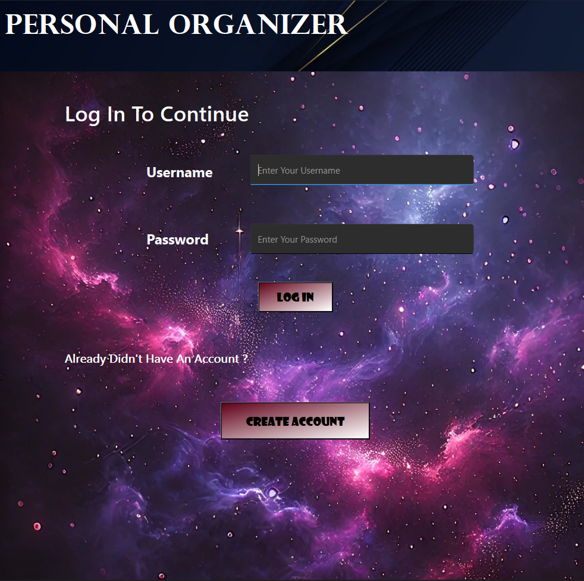

I did this project for academic purpose in my university by using QT Creator.but it asks for real world requrements.i mention that requrements below.

# Personal Organizer

# Key Features:

### User Account System:
Each user can create an account with a username and password.
Data is saved in a file or database
### Income and Expense Tracker:
Users can add income sources (job, allowance from parents, scholarships, student aid) and expenses.
Each entry will have a date, description, category (food, entertainment, traveling, clothing, education equipment, university fees), and amount.
### Category-Based Budgeting:
Users can set monthly target budgets for different categories (e.g. Rs. 2000 for entertainment)
The program alerts when a budget is exceeded.
### Financial Reports:
Generate monthly reports showing total income, total expenses, and savings.
Graphical representation of expenses by category using charts (bar graph). This should show the current status on each day with how much have been spent and how much remains.
### Academic schedule:
Users can add their weekly lecture schedule and set the time duration for it.
Users should be able to include important dates such as assignment deadlines and the program should give alerts when nearing a deadline.
### GUI Component:
Use a C++ GUI framework like Qt or .Net to create a user-friendly interface.
Display income/expense forms, graphs, and reports.
Buttons for adding income, expenses, generating reports, etc.
### Data Persistence:
Cane use a DBMS (for bonus marks) or file handling (CSV or text files) to store and retrieve user data. Using json is also accepted.

